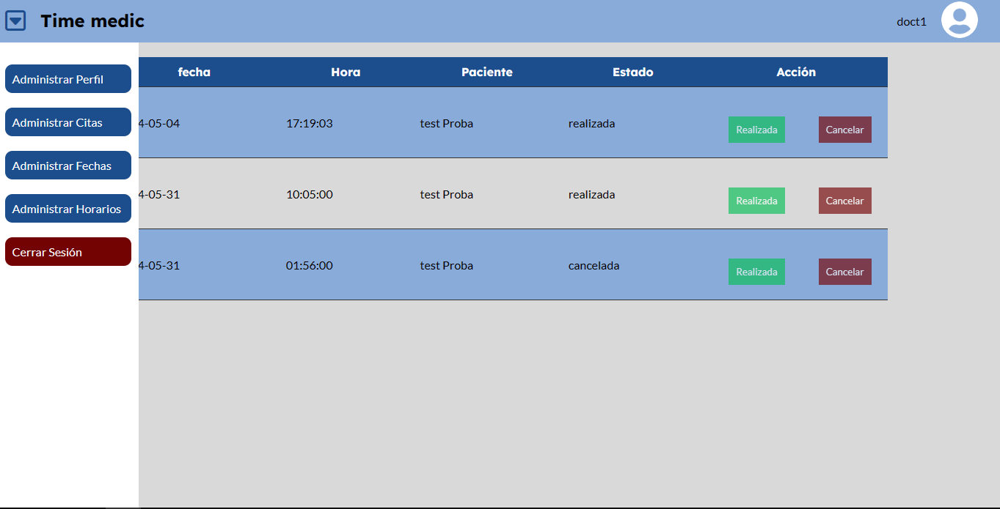

# Time Medic

## Descripción

Time medic es un proyecto en php que permite la administración de citas medicas a través de un aplicativo web

## Imagenes del proyecto





## Funcionalidades principales

El proyecto permite registrarse e iniciar sesion, permite tres tipos de usuarios que pueden realizar diferentes acciones:

`Administradores:` Administran la aplicación, la creación de los usuarios, las fechas y horarios que pueden usar los doctores, así como tambien las especialidades disponibles en el sistema

`Doctores:` Pueden ver las citas que tienen y marcarlas como realizadas o cancelarlas

`Pacientes:` Pueden ver sus citas y hacer nuvas citas con los doctores


## Estructura del proyecto

```
├── config
│   └── db.php
├── app
│   ├── controller
│   ├── model
│	└── public
│   	├── css
│		└── js
└── db
```
`config`: contine los archivos para acceder a la base de datos

`db`: contine la base de datos sqlite

`app`: contine los archivos del proyecto, se uso el modelo mvc

`controllers`: contine los archivos que permiten el manejo de lsa peticiones provenientes de las vistas del proyecto

`models`: contine los archivos que permiten la interacción de la aplicación con la base de datos

`Public`: contine los archivos que funcionan como vistas y con los que el usuario va a interactuar dentro del sitio web

`css`: contine los estilos del proyecto

`js`: contine el javascript que le da interactividad a la pagina